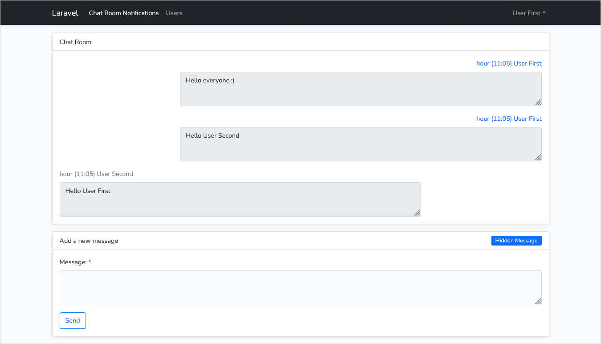
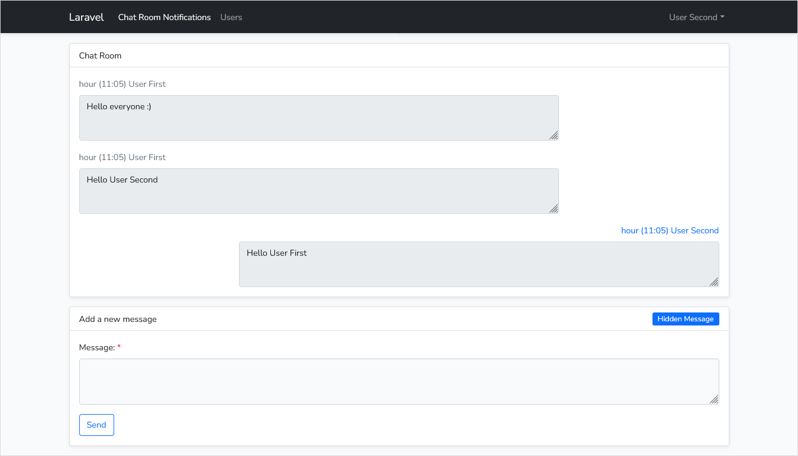
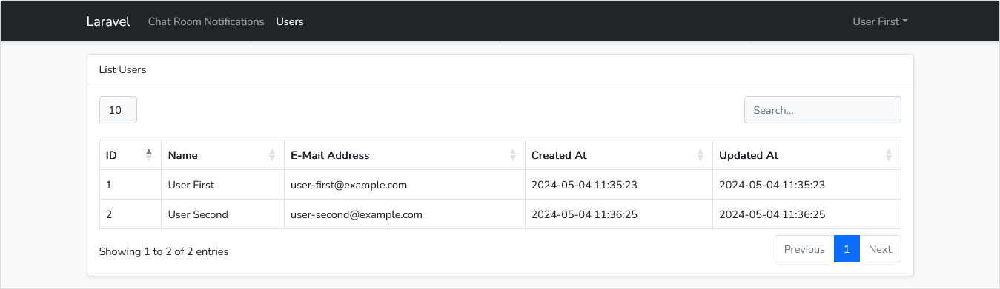

# Laravel chat room

The project is a SPA realtime chat room basically based on the [Laravel 10](https://laravel.com/docs/10.x/installation), [Inertia](https://inertiajs.com/) and [Bootstrap 5](https://getbootstrap.com/docs/5.2/getting-started/introduction/).

## Setup

Clone the repo and follow below steps.

1. Run `composer install`
2. Copy `.env.example` to `.env`
3. Run `php artisan key:generate` to generate application key
4. Set valid database credentials of env variables `DB_DATABASE`, `DB_USERNAME`, and `DB_PASSWORD`
5. Run `php artisan migrate` to start all migrations
6. Run `php artisan websockets:serve` to start websockets
7. Run `npm i` (Recommended node version `>= V18.16.0`)
8. Run `npm run dev` or `npm run build` as per your environment

## Credits & References

The following software libraries and other references are utilized in the creation this project.

- [Laravel](https://github.com/laravel/laravel)
- [Laravel UI](https://github.com/laravel/ui)
- [Inertia Laravel](https://github.com/inertiajs/inertia-laravel)
- [Tighten Ziggy](https://github.com/tighten/ziggy)
- [Beyond Code Laravel Websockets](https://github.com/beyondcode/laravel-websockets)
- [Bootstrap](https://getbootstrap.com/)
- [DataTables](https://github.com/DataTables/Dist-DataTables-Bootstrap4)

## License

The project is open-sourced software licensed under the [MIT license](https://opensource.org/licenses/MIT).

## ScreenShots

## Chat Room notifications for User First

## Chat Room notifications for User Second

## List Users

